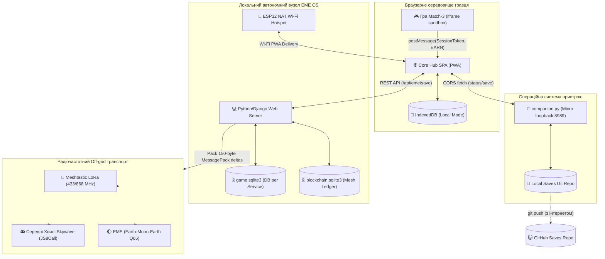

# Повне Технічне Завдання (ТЗ) — Версія 5.0 (Остаточна)
# «Mine & Craft Avatar Hub» в автономній інфраструктурі EME
## Гібридна Web-Git та Off-Grid Радіо-Mesh Екосистема

**Версія документа:** 5.0 (Engineering & Integration Specification)  
**Дата:** 20 травня 2026  
**Статус:** Затверджено до реалізації  
**Призначення:** Повне архітектурне та програмне керівництво для розробників, системних інтеграторів та радіоінженерів.

---

## Зміст
1. [Архітектурна концепція та філософія взаємодії](#1-архітектурна-концепція-та-філософія-взаємодії)  
2. [Глобальна топологія системи (Схема)](#2-глобальна-топологія-системи-схема)  
3. [Специфікація 4 режимів роботи Хабу](#3-специфікація-4-режимів-роботи-хабу)  
4. [Апаратна та системна EME Mesh інфраструктура](#4-апаратна-та-системна-eme-mesh-інфраструктура)  
5. [Специфікація Delta-Sync, конфліктів та блокчейну EME](#5-специфікація-delta-sync-конфліктів-та-блокчейну-eme)  
6. [Архітектура безпеки та ізоляція (Secure Sandbox)](#6-архітектура-безпеки-та-ізоляція-secure-sandbox)  
7. [Кроссплатформенний Desktop Companion (`companion.py`)](#7-кроссплатформенний-desktop-companion-companionpy)  
8. [Функціональні вимоги до ігрових модулів](#8-функціональні-вимоги-до-ігрових-модулів)  
9. [Специфікація даних: JSON-схеми та SQLite моделі](#9-специфікація-даних-json-схеми-та-sqlite-моделі)  
10. [Стратегія кроссплатформенного розгортання (Bootstrapping)](#10-стратегія-кроссплатформенного-розгортання-bootstrapping)  
11. [Дорожня карта розробки та злиття модулів](#11-дорожня-карта-розробки-та-злиття-модулів)

---

## 1. Архітектурна концепція та філософія взаємодії

Платформа є **гібридною, локально-орієнтованою (Local-First), стійкою до відмов (Survival) ігровою та комунікаційною екосистемою**. Вона спроектована для безшовної роботи у двох протилежних інфраструктурних середовищах за рахунок модульного зв'язку (симбіозу) ігрової платформи та автономної радіомережі EME (Earth-Moon-Earth).

### 1.1 Межі симбіозу
*   **Ігрова платформа (Хаб):** Використовується як точка входу користувача. Надає візуальний PWA-інтерфейс, гру Match-3 для генерації ресурсів, кастомізатор аватара та механізми валідації.
*   **Інфраструктура EME Mesh:** Виступає як суверенний off-grid транспорт. Вона бере на себе завдання збереження даних у SQLite, ретрансляції ігрового стану через локальні LoRa-модулі та передачу дельт збережень через відскок від Місяця або середні хвилі.
*   **Незалежність:** Обидва модулі можуть працювати ізольовано. Якщо у гравця є інтернет, Хаб синхронізується з GitHub (Cloud/Hybrid). Якщо інтернет зникає, Хаб виявляє локальний EME-вузол і переходить в режим повністю автономної радіо-синхронізації.

---

## 2. Глобальна топологія системи (Схема)

Нижче наведена топологічна схема проходження даних від кінцевого гравця в Match-3 (в ізольованій пісочниці) до локальних Mesh-капілярів та космічного зв'язку:



---

## 3. Специфікація 4 режимів роботи Хабу

Платформа адаптується до умов мережі шляхом автоматичного вибору одного з чотирьох режимів:

| Режим | Умова активації | Транспорт збереження | Затримка | Квоти та обмеження |
|---|---|---|---|---|
| **1. Local Mode** | Відсутній інтернет та Companion | IndexedDB браузера (кастомний wrapper) | <1 ms | Обмежено квотами квотування IndexedDB пристрою |
| **2. Cloud Mode** | Є інтернет, налаштований PAT / Device Flow | GitHub Gists / `repository_dispatch` -> GitHub Actions | 15–45 s | Ліміт Actions (2000 хв/міс), API Rate Limit (5000 запр/год) |
| **3. Hybrid Desktop**| Запущено `companion.py` на `127.0.0.1:8989` | Локальний Git Commit & Push через CLI терміналу | <5 ms | Немає (квоти Actions не спалюються) |
| **4. EME Mesh Mode** | Хаб хоститься на EME OS вузлі (офлайн) | HTTP REST API -> `game.sqlite3` -> Радіо-черга | 5–10 ms | Швидкість радіопередачі (100–250 bps), черга радіовікон |

---

## 4. Апаратна та системна EME Mesh інфраструктура

Автономна частина системи призначена для роботи без інтернету. Вона базується на децентралізованих вузлах зв'язку.

### 4.1 Фізичний рівень далекого зв'язку (EME та MW)

#### A. Earth-Moon-Earth ( Moon Bounce )
Використовує Місяць як пасивний відбивач радіосигналу на частотах VHF/UHF/SHF.
*   **Втрати на трасі (Free-Space Path Loss + Reflection Loss):**
    Враховуючи відстань до Місяця ($d \approx 384,400 \text{ км}$, повний шлях $770,000 \text{ км}$) та коефіцієнт відбиття поверхні Місяця (радіо-альбедо $\rho \approx 0.07$):
    $$L_{\text{path}} \text{ (dB)} \approx 22 + 20 \log_{10}\left(\frac{2d}{\lambda}\right) - 10 \log_{10}(\rho)$$
    - На $144 \text{ MHz}$ (VHF): $L_{\text{path}} \approx 252 \text{ dB}$.
    - На $1296 \text{ MHz}$ (UHF): $L_{\text{path}} \approx 271 \text{ dB}$.
*   **Орбітальні фактори:**
    - *Mutual Window:* Обидві земні станції повинні одночасно бачити Місяць.
    - *Libration Fading:* Швидкі федінги сигналу до $20 \text{ dB}$ через коливання Місяця.
    - *Ефект Фарадея:* обертання поляризації в іоносфері. Вимагає використання кругової поляризації.
*   **Протоколи надслабких сигналів:**
    - Використовується протокол **Q65** або **JT65** з модулюванням MFSK та завадостійким кодуванням LDPC.
    - Дозволяє декодувати сигнал при $SNR \approx -25 \text{ dB} \dots -31 \text{ dB}$ в смузі $2500 \text{ Hz}$ (глибоко під шумами ефіру).

#### B. Повільний Середньохвильовий Інтернет (Medium Wave Skywave)
Використовує відбиття від шарів іоносфери E та F в нічний час на частотах $530\text{--}1600 \text{ kHz}$.
*   **Транспортний протокол:** **JS8Call** або **VarAC** (OFDM модуляція з ARQ).
*   **Швидкість:** $31 \text{ bps}$ (надстійкий JS8) до $5000 \text{ bps}$ (VarAC при стабільному Skywave).

---

### 4.2 Капілярна мережа локального розповсюдження

1. **Meshtastic (LoRa Mesh):**
   - Працює на частотах $433 \text{ / } 868 \text{ MHz}$ на базі чипів Semtech SX1262.
   - Ретранслює пакети методом Flood Routing. Радіус покриття вузла — $2\text{--}15 \text{ км}$.
2. **ESP32 NAT Routers:**
   - Мікроконтролер ESP32 із прошивкою `esp32_nat_router.bin` поднімає Wi-Fi точку доступу із вбудованим NAT-сервером.
   - Користувачі підключаються смартфонами і грають в ігри з локального веб-сервера вузла.

---

### 4.3 Ізоляція баз даних у EME OS (Database-per-service)

Для мінімізації трафіку через радіоканали, EME OS розділяє SQLite бази даних. Згідно з `fixed_db_router.py` та `fixed_settings.py` з вашого робочого простору, конфігурація Django-маршрутизатора має такий вигляд:

```python
class ModuleRouter:
    route_mapping = {
        'eme_kb': 'kb',            # База знань (kb.sqlite3)
        'eme_media': 'media',      # Медіа-асети (media.sqlite3)
        'eme_ai': 'ai',            # Дані ШІ моделей (ai.sqlite3)
        'park_adventures': 'game', # Ігровий модуль (game.sqlite3)
        'eme_mafia': 'mafia',      # Гра Мафія (mafia.sqlite3)
        'eme_utils': 'utils',      # Утиліти (utils.sqlite3)
    }
```

---

## 5. Специфікація Delta-Sync, конфліктів та блокчейну EME

### 5.1 Формат дельта-патча для радіосинхронізації
Для забезпечення безпомилкової передачі стану гравця через надповільні радіоканали ($31\text{--}250 \text{ bps}$) забороняється передача повних файлів збереження `save.json` або бази `game.sqlite3`.
*   **Специфікація алгоритму дельти:**
    *   Використовується бінарний диференціальний алгоритм **rdiff** (на базі логіки librsync) або **власний формат SQL-дельта логування**.
    *   При кожній транзакції локальний Django-сигналізатор фіксує послідовність змін рядків бази даних `game.sqlite3` у вигляді масиву операцій `[OP_TYPE, ROW_ID, COLUMN, VALUE]`.
*   **Серіалізація MessagePack:**
    *   Отриманий масив дельт серіалізується у бінарний потік за допомогою **MessagePack** (замість текстового JSON). Це скорочує надлишковість даних (metadata overhead) на **$65\text{--}80\%$**.
    *   Для додаткової компресії застосовується алгоритм **LZMA** або **Zstandard** з налаштуваннями для мікро-пакетів.
    *   **Гарантований розмір пакета:** $\le 150 \text{ байт}$ для стандартної ігрової сесії Match-3 (Seq Increment, додавання золота/рубінів).

---

### 5.2 Поведінка при конфліктах у EME Mesh (Conflict Resolution)
Коли гравець переміщується між двома віддаленими офлайновими Mesh-нодами та надсилає різні дельти збережень на обох вузлах, виникає стан розходження (split-brain).
*   **Канонічний алгоритм: LWW (Last-Writer-Wins):**
    *   Кожне збереження містить монотонно зростаючий лічильник послідовності (`player.sequence`) та мітку часу з точністю до мілісекунд (зафіксовану за локальним RTC або GPS-часом вузла).
    *   При отриманні конфліктних дельт Django-сервер автоматично порівнює `sequence`. Нода приймає версію з **найбільшим показником `sequence`**.
    *   Якщо `sequence` збігається, пріоритет віддається останній часовій мітці (Last-Writer-Wins за міткою часу).
*   **Ручний вибір через UI (Interactive Conflict Override):**
    *   Якщо лічильники розходяться нелінійно (наприклад, паралельні зміни на двох пристроях без зв'язку), Хаб виявляє розбіжність при першому контакті з мережею та блокує автоматичний перезапис.
    *   На екран PWA виводиться модальне вікно порівняння: відображаються параметри обох сейвів (Дата, Баланс ресурсів, Склад інвентарю). Користувач може обрати одну з версій або здійснити злиття (merge) ресурсів.

---

### 5.3 Суверенний Mesh-Блокчейн
Для стимулювання власників off-grid радіовузлів та сонячних електростанцій, в системі працює децентралізований легковажний блокчейн.

#### Консенсус Proof of Coverage (PoC)
Майнінг блоку зав'язаний на кількості активних сусідніх Mesh-нод (`neighbors_count`).
*   **Алгоритм пошуку доказу покриття:**
    ```python
    hash_operation = hashlib.sha256(
        str(new_proof**2 - previous_proof**2 + neighbors_count).encode()
    ).hexdigest()
    # Блок вважається знайденим, якщо hash_operation[:4] == '0000'
    ```

#### Специфікація транзакцій та радіонагород:
Блокчейн автоматично випускає токени (`EME_TOKEN`) для заохочення операторів інфраструктури:

| Тип транзакції | Метод у коді | Нагорода (Токени) | Технічна мета |
|---|---|---|---|
| **MW Sync Incentive** | `add_mw_sync` | **10** | За успішну далеку радіопередачу дельт гравців через СХ/КХ |
| **Solar Station Setup**| `add_solar_setup` | **20** | Одноразовий бонус за валідацію сонячної панелі (Green node) |
| **Solar Uptime Setup** | `add_solar_uptime`| **1.0 + 0.3 за кВт·год**| За безперебійне живлення вузла від сонячної енергії |
| **Proof of Coverage** | `mine_block` | **1.0 + 0.5 за сусіда**| Нагорода за майнінг блоку у щільній Mesh-зоні |
| **Referral Tree** | `add_referral` | **10 новій ноді** | Стимулювання розширення радіомережі (Батьківська нода отримує: 1 рівень - 20%, 2 рівень - 10%, 3 рівень - 5%, 4 рівень - 2.5%, 5 рівень - 1.25%) |

---

## 6. Архітектура безпеки та ізоляція (Secure Sandbox)

### 6.1 Ізоляція ігор (Opaque Sandbox)
Усі сторонні ігри запускаються всередині iframe:
```html
<iframe src="games/match3/index.html" sandbox="allow-scripts"></iframe>
```
*   **Заборона `allow-same-origin`:** Оскільки гра запускається без цього прапорця, браузер надає їй статус `opaque origin`. Гра не має доступу до `window.parent.localStorage`, `IndexedDB` або DOM головного Хабу.

### 6.2 Session Token Handshake (UUID)
Безпечний обмін даними здійснюється за моделлю Bearer Capability:
```
[ Hub Core ]                                              [ Match-3 Game ]
     │                                                            │
     │── 1. Generate sessionToken (UUID) ────────────────────────>│
     │── 2. Load iframe?token=4a5b-6c7d... ─────────────────────>│
     │                                                            │
     │                                  (Game completes level)    │
     │                                                            │
     │<── 3. postMessage({token: UUID, earned: gold: 45}) ────────│
     │                                                            │
     │── 4. Verify token, validate limit (earned/duration) ──────>│
     │── 5. Add to queue, update UI status (Syncing) ────────────>│
```

### 6.3 Content Security Policy (CSP)
Для запобігання XSS та викрадення токенів, Хаб віддає наступний CSP-заголовок (або мета-тег):
```html
<meta http-equiv="Content-Security-Policy" content="
  default-src 'self';
  script-src 'self' 'unsafe-inline';
  connect-src 'self' https://api.github.com https://raw.githubusercontent.com http://127.0.0.1:* http://localhost:8989;
  img-src 'self' https://raw.githubusercontent.com data:;
  frame-src 'self' 'self' https://*.github.io;
">
```

---

## 7. Кроссплатформенний Desktop Companion (`companion.py`)

Companion — це легковажний, автономний, кроссплатформенний агент (Windows, macOS, Linux, Android Termux), написаний на чистому Python 3. Він запускає HTTP-сервер на порту `8989`.

### 7.1 Специфікація API Companion

#### 1. Перевірка статусу (CORS OPTIONS & GET)
*   **Запит:** `GET http://127.0.0.1:8989/status`
*   **Відповідь:** `200 OK`
```json
{
  "status": "ready",
  "os": "windows",
  "mode": "hybrid_git",
  "git_repo": true,
  "eme_support": false
}
```

#### 2. Збереження стану (POST /save)
*   **Запит:** `POST http://127.0.0.1:8989/save`
*   **Тіло запиту:** JSON-об'єкт стану збереження гравця.
*   **Логіка роботи:** Записує файл збереження у локальний репозиторій сейвів: `saves/players/{player_id}/save.json`, додає запис у журнал `history.jsonl` та запускає фоновий потік для Git-автоматизації (`git add`, `git commit -m "Auto-save sequence #{sequence}"`, `git push`).

---

## 8. Функціональні вимоги до ігрових модулів

### 8.1 Хаб (Лобі)
- **Візуалізація аватара:** Динамічне збирання шарів 256x256 PNG на канвас. Обов'язкове використання `img.crossOrigin = "anonymous"` для запобігання забрудненню Canvas (Tainted Canvas).
- **Редактор персонажа:** Вибір елементів (Base, Eyes, Hair, Outfit) з інвентаря, збереження оновлює стан.
- **Магазин:** Перевірка балансу ресурсів. Ціни в рубінах, сапфірах, смараздах, золоті та EME-токенах.

### 8.2 Гра Match-3 (видобуток ресурсів)
- Поле 8x8 на HTML5 Canvas.
- Кольори камінців відповідають ресурсам: Червоний (`resource:ruby`), Синій (`resource:sapphire`), Зелений (`resource:emerald`), Жовтий (`resource:gold`).
- Ліміт ходів: 30.
- М'яка валідація швидкості:
  $$\Delta \text{Resource} \le \Delta t \text{ (seconds)} \times \text{maxRatePerSecond}$$
  де `maxRatePerSecond` для золота дорівнює `2.5`.

---

## 9. Специфікація даних: JSON-схеми та SQLite моделі

### 9.1 Схема збереження гравця (`save.json`)
```json
{
  "$schema": "https://mine-avatar.github.io/schemas/save-v3.json",
  "version": 3,
  "player": {
    "username": "taras_radio",
    "sequence": 105,
    "last_sync_hash": "b2c3d4e5"
  },
  "resources": {
    "resource:ruby": 150,
    "resource:sapphire": 80,
    "resource:emerald": 45,
    "resource:gold": 500,
    "resource:eme_token": 120.0
  },
  "inventory": {
    "charItems": ["skin_default", "hair_neon", "eyes_cyborg"],
    "unlockedGames": ["match3"]
  },
  "activeCharacter": {
    "base": "skin_default",
    "hair": "hair_neon",
    "eyes": "eyes_cyborg"
  },
  "last_session": {
    "game_id": "match3",
    "game_version": "1.2.0",
    "duration": 120,
    "earned": {
      "resource:gold": 45
    }
  }
}
```

### 9.2 Маніфест ігрового Asset Pack (`manifest.json`)
Для забезпечення безпечної сумісності між сторонніми наборами асетів та ядром Хабу, кожен маніфест зобов'язаний містити поле `minHubVersion`. Це запобігає завантаженню несумісних шейдерів, стилів чи логіки у старі версії клієнтів.
```json
{
  "id": "cyberpunk_pack",
  "name": "Cyberpunk Outfits",
  "version": "1.0.0",
  "minHubVersion": "3.0.0",
  "items": [
    {
      "id": "hair_neon",
      "type": "hair",
      "sprite": "sprites/hair_neon.png",
      "price": {
        "resource:ruby": 50,
        "resource:eme_token": 10
      }
    }
  ]
}
```

---

## 10. Стратегія кроссплатформенного розгортання (Bootstrapping)

Система розгортається без компіляторів. Кінцевий пакет доступний у Git-репозиторії.

### 10.1 Для мобільних телефонів (Android / iOS)
*   **Android (Termux):**
    Користувач встановлює Termux та виконує завантаження та старт однією командою:
    ```bash
    pkg update && pkg install git python -y && git clone https://github.com/username/mine-avatar-hub.git && cd mine-avatar-hub && python companion.py
    ```
    Після чого відкриває браузер смартфона на `http://127.0.0.1:8989` для роботи у локальному Mesh-режимі.

---

## 11. Дорожня карта розробки та злиття модулів

### ЧАСТИНА А: Базове PWA-ядро (GitHub Core) — Фаза 1 & 2
- **Спринт 1:** Дизайн Лобі (styles.css), IndexedDB менеджер (database.js) та Canvas рендерер аватара.
- **Спринт 2:** Sandbox iframe Match-3, Session Token Handshake, м'яка валідація швидкості.
- **Спринт 3:** Написання `companion.py` на чистому Python (підтримка Windows, Linux, macOS, Termux).

### ЧАСТИНА Б: Автономна EME інфраструктура — Фаза 3 & 4
- **Спринт 4:** Налаштування Django `ModuleRouter` для SQLite баз даних (`game.sqlite3`, `blockchain.sqlite3`).
- **Спринт 5:** Створення сервісу `sync_service.py` для генерації 150-байтних SQL-дельт через MessagePack та Zstandard.
- **Спринт 6:** Впровадження LWW конфліктного вирішення, інтеграція блокчейн-транзакцій та радіонагород (`add_mw_sync`) з Match-3 в EME Mesh Mode.
